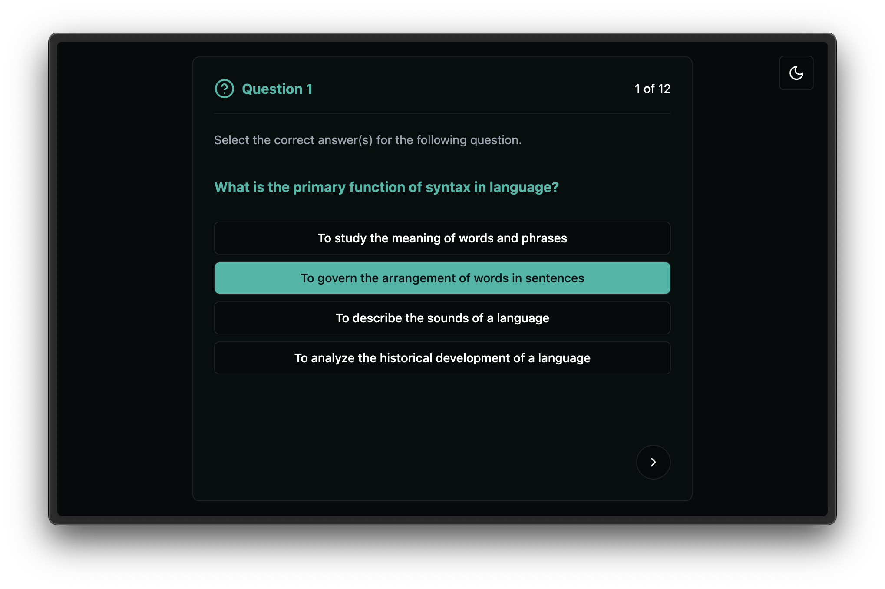

# Automatic feedback generation

<details>
  <summary>Table of Contents</summary>
  <ol>
    <li>
      <a href="#about-the-project">About The Project</a>
      <ul>
        <li><a href="#built-with">Built With</a></li>
      </ul>
    </li>
    <li>
      <a href="#getting-started">Getting Started</a>
      <ul>
        <li><a href="#prerequisites">Prerequisites</a></li>
        <li><a href="#installation">Installation</a></li>
      </ul>
    </li>
    <li><a href="#demo">Demo</a></li>
    <li><a href="#license">License</a></li>
  </ol>
</details>



## About the project

### Built with

- [![Flask][Flask]][Flask-url]
- [![LangChain][LangChain]][LangChain-url]
- [![React][React]][React-url]
- [![Shadcn][Shadcn]][Shadcn-url]

## Getting started

### Prerequisites

- ![Python Version][python-version]
- ![Node Version][node-version]
- ![OpenAI API key][openai-apikey]
- ![Mistral API key][mistral-apikey]
<!-- Ajouter clé Together -->

### Installation

1. Clone the repo
    ```sh
    git clone https://github.com/kylian-fage/feedback-generation.git
    ```

2. Setup the project
    ```sh
    make setup
    ```

3. Complete the `.env.example` file and change its name to `.env`

4. Run the server
   - With `npm`

        ```sh
        npm run dev
        ```

   - With `make`

        ```sh
        make run-dev
        ```

## Demo

*Yet to come*

## License

Distributed under the MIT License. See [LICENSE](https://github.com/kylian-fage/feedback-generation/blob/main/LICENSE) for more information.

[shadcn]: https://img.shields.io/badge/shadcn-%23000?logo=shadcn%2Fui&logoColor=black&labelColor=white
[shadcn-url]: https://ui.shadcn.com/
[langchain]: https://img.shields.io/badge/%F0%9F%A6%9C%F0%9F%94%97-LangChain-green?labelColor=white
[langchain-url]: https://www.langchain.com/
[react]: https://img.shields.io/badge/React-%2300D8FF?logo=react&labelColor=white
[react-url]: https://react.dev/
[flask]: https://img.shields.io/badge/Flask-%233BA9BF?logo=flask&logoColor=%233BA9BF&labelColor=white
[flask-url]: https://flask.palletsprojects.com/
[python-version]: https://img.shields.io/badge/Python-^3.12-silver?labelColor=white&logo=python
[node-version]: https://img.shields.io/badge/Node.js-^20.0-silver?labelColor=white&logo=node.js
[openai-apikey]: https://img.shields.io/badge/OpenAI-API%20key-silver?style=flat&logo=openai&logoColor=black&labelColor=white
[mistral-apikey]: https://img.shields.io/badge/Mistral-API%20key-silver?logo=data%3Aimage%2Fsvg%2Bxml%3Bbase64%2CPD94bWwgdmVyc2lvbj0iMS4wIiBlbmNvZGluZz0iVVRGLTgiPz4KPHN2ZyB3aWR0aD0iMjU2cHgiIGhlaWdodD0iMjMzcHgiIHZpZXdCb3g9IjAgMCAyNTYgMjMzIiB2ZXJzaW9uPSIxLjEiIHhtbG5zPSJodHRwOi8vd3d3LnczLm9yZy8yMDAwL3N2ZyIgcHJlc2VydmVBc3BlY3RSYXRpbz0ieE1pZFlNaWQiPgogICAgPHRpdGxlPk1pc3RyYWwgQUk8L3RpdGxlPgogICAgPGc%2BCiAgICAgICAgPHJlY3QgZmlsbD0iIzAwMDAwMCIgeD0iMTg2LjE4MTgxOCIgeT0iMCIgd2lkdGg9IjQ2LjU0NTQ1NDUiIGhlaWdodD0iNDYuNTQ1NDU0NSI%2BPC9yZWN0PgogICAgICAgIDxyZWN0IGZpbGw9IiNGN0QwNDYiIHg9IjIwOS40NTQ1NDUiIHk9IjAiIHdpZHRoPSI0Ni41NDU0NTQ1IiBoZWlnaHQ9IjQ2LjU0NTQ1NDUiPjwvcmVjdD4KICAgICAgICA8cmVjdCBmaWxsPSIjMDAwMDAwIiB4PSIwIiB5PSIwIiB3aWR0aD0iNDYuNTQ1NDU0NSIgaGVpZ2h0PSI0Ni41NDU0NTQ1Ij48L3JlY3Q%2BCiAgICAgICAgPHJlY3QgZmlsbD0iIzAwMDAwMCIgeD0iMCIgeT0iNDYuNTQ1NDU0NSIgd2lkdGg9IjQ2LjU0NTQ1NDUiIGhlaWdodD0iNDYuNTQ1NDU0NSI%2BPC9yZWN0PgogICAgICAgIDxyZWN0IGZpbGw9IiMwMDAwMDAiIHg9IjAiIHk9IjkzLjA5MDkwOTEiIHdpZHRoPSI0Ni41NDU0NTQ1IiBoZWlnaHQ9IjQ2LjU0NTQ1NDUiPjwvcmVjdD4KICAgICAgICA8cmVjdCBmaWxsPSIjMDAwMDAwIiB4PSIwIiB5PSIxMzkuNjM2MzY0IiB3aWR0aD0iNDYuNTQ1NDU0NSIgaGVpZ2h0PSI0Ni41NDU0NTQ1Ij48L3JlY3Q%2BCiAgICAgICAgPHJlY3QgZmlsbD0iIzAwMDAwMCIgeD0iMCIgeT0iMTg2LjE4MTgxOCIgd2lkdGg9IjQ2LjU0NTQ1NDUiIGhlaWdodD0iNDYuNTQ1NDU0NSI%2BPC9yZWN0PgogICAgICAgIDxyZWN0IGZpbGw9IiNGN0QwNDYiIHg9IjIzLjI3MjcyNzMiIHk9IjAiIHdpZHRoPSI0Ni41NDU0NTQ1IiBoZWlnaHQ9IjQ2LjU0NTQ1NDUiPjwvcmVjdD4KICAgICAgICA8cmVjdCBmaWxsPSIjRjJBNzNCIiB4PSIyMDkuNDU0NTQ1IiB5PSI0Ni41NDU0NTQ1IiB3aWR0aD0iNDYuNTQ1NDU0NSIgaGVpZ2h0PSI0Ni41NDU0NTQ1Ij48L3JlY3Q%2BCiAgICAgICAgPHJlY3QgZmlsbD0iI0YyQTczQiIgeD0iMjMuMjcyNzI3MyIgeT0iNDYuNTQ1NDU0NSIgd2lkdGg9IjQ2LjU0NTQ1NDUiIGhlaWdodD0iNDYuNTQ1NDU0NSI%2BPC9yZWN0PgogICAgICAgIDxyZWN0IGZpbGw9IiMwMDAwMDAiIHg9IjEzOS42MzYzNjQiIHk9IjQ2LjU0NTQ1NDUiIHdpZHRoPSI0Ni41NDU0NTQ1IiBoZWlnaHQ9IjQ2LjU0NTQ1NDUiPjwvcmVjdD4KICAgICAgICA8cmVjdCBmaWxsPSIjRjJBNzNCIiB4PSIxNjIuOTA5MDkxIiB5PSI0Ni41NDU0NTQ1IiB3aWR0aD0iNDYuNTQ1NDU0NSIgaGVpZ2h0PSI0Ni41NDU0NTQ1Ij48L3JlY3Q%2BCiAgICAgICAgPHJlY3QgZmlsbD0iI0YyQTczQiIgeD0iNjkuODE4MTgxOCIgeT0iNDYuNTQ1NDU0NSIgd2lkdGg9IjQ2LjU0NTQ1NDUiIGhlaWdodD0iNDYuNTQ1NDU0NSI%2BPC9yZWN0PgogICAgICAgIDxyZWN0IGZpbGw9IiNFRTc5MkYiIHg9IjExNi4zNjM2MzYiIHk9IjkzLjA5MDkwOTEiIHdpZHRoPSI0Ni41NDU0NTQ1IiBoZWlnaHQ9IjQ2LjU0NTQ1NDUiPjwvcmVjdD4KICAgICAgICA8cmVjdCBmaWxsPSIjRUU3OTJGIiB4PSIxNjIuOTA5MDkxIiB5PSI5My4wOTA5MDkxIiB3aWR0aD0iNDYuNTQ1NDU0NSIgaGVpZ2h0PSI0Ni41NDU0NTQ1Ij48L3JlY3Q%2BCiAgICAgICAgPHJlY3QgZmlsbD0iI0VFNzkyRiIgeD0iNjkuODE4MTgxOCIgeT0iOTMuMDkwOTA5MSIgd2lkdGg9IjQ2LjU0NTQ1NDUiIGhlaWdodD0iNDYuNTQ1NDU0NSI%2BPC9yZWN0PgogICAgICAgIDxyZWN0IGZpbGw9IiMwMDAwMDAiIHg9IjkzLjA5MDkwOTEiIHk9IjEzOS42MzYzNjQiIHdpZHRoPSI0Ni41NDU0NTQ1IiBoZWlnaHQ9IjQ2LjU0NTQ1NDUiPjwvcmVjdD4KICAgICAgICA8cmVjdCBmaWxsPSIjRUI1ODI5IiB4PSIxMTYuMzYzNjM2IiB5PSIxMzkuNjM2MzY0IiB3aWR0aD0iNDYuNTQ1NDU0NSIgaGVpZ2h0PSI0Ni41NDU0NTQ1Ij48L3JlY3Q%2BCiAgICAgICAgPHJlY3QgZmlsbD0iI0VFNzkyRiIgeD0iMjA5LjQ1NDU0NSIgeT0iOTMuMDkwOTA5MSIgd2lkdGg9IjQ2LjU0NTQ1NDUiIGhlaWdodD0iNDYuNTQ1NDU0NSI%2BPC9yZWN0PgogICAgICAgIDxyZWN0IGZpbGw9IiNFRTc5MkYiIHg9IjIzLjI3MjcyNzMiIHk9IjkzLjA5MDkwOTEiIHdpZHRoPSI0Ni41NDU0NTQ1IiBoZWlnaHQ9IjQ2LjU0NTQ1NDUiPjwvcmVjdD4KICAgICAgICA8cmVjdCBmaWxsPSIjMDAwMDAwIiB4PSIxODYuMTgxODE4IiB5PSIxMzkuNjM2MzY0IiB3aWR0aD0iNDYuNTQ1NDU0NSIgaGVpZ2h0PSI0Ni41NDU0NTQ1Ij48L3JlY3Q%2BCiAgICAgICAgPHJlY3QgZmlsbD0iI0VCNTgyOSIgeD0iMjA5LjQ1NDU0NSIgeT0iMTM5LjYzNjM2NCIgd2lkdGg9IjQ2LjU0NTQ1NDUiIGhlaWdodD0iNDYuNTQ1NDU0NSI%2BPC9yZWN0PgogICAgICAgIDxyZWN0IGZpbGw9IiMwMDAwMDAiIHg9IjE4Ni4xODE4MTgiIHk9IjE4Ni4xODE4MTgiIHdpZHRoPSI0Ni41NDU0NTQ1IiBoZWlnaHQ9IjQ2LjU0NTQ1NDUiPjwvcmVjdD4KICAgICAgICA8cmVjdCBmaWxsPSIjRUI1ODI5IiB4PSIyMy4yNzI3MjczIiB5PSIxMzkuNjM2MzY0IiB3aWR0aD0iNDYuNTQ1NDU0NSIgaGVpZ2h0PSI0Ni41NDU0NTQ1Ij48L3JlY3Q%2BCiAgICAgICAgPHJlY3QgZmlsbD0iI0VBMzMyNiIgeD0iMjA5LjQ1NDU0NSIgeT0iMTg2LjE4MTgxOCIgd2lkdGg9IjQ2LjU0NTQ1NDUiIGhlaWdodD0iNDYuNTQ1NDU0NSI%2BPC9yZWN0PgogICAgICAgIDxyZWN0IGZpbGw9IiNFQTMzMjYiIHg9IjIzLjI3MjcyNzMiIHk9IjE4Ni4xODE4MTgiIHdpZHRoPSI0Ni41NDU0NTQ1IiBoZWlnaHQ9IjQ2LjU0NTQ1NDUiPjwvcmVjdD4KICAgIDwvZz4KPC9zdmc%2BCg%3D%3D&labelColor=white
